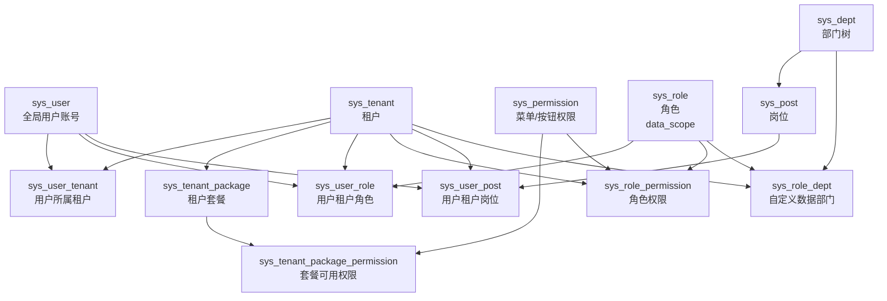
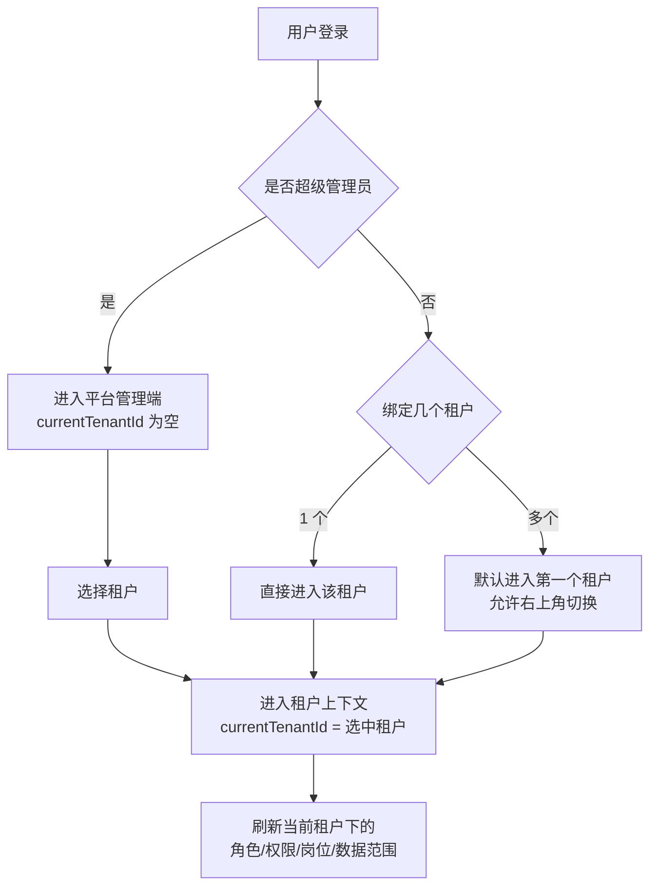

# Whim 多租户与权限架构

## 整体关系



## 登录与租户切换



## 关系说明

`sys_user` 是全局账号，不直接代表某个租户身份。一个用户可以通过 `sys_user_tenant` 进入多个租户。

`currentTenantId` 表示当前正在操作的租户。普通用户只能切换自己绑定的租户，超级管理员可以进入平台管理端，也可以切换到任意租户。

`sys_tenant_package` 和 `sys_tenant_package_permission` 定义租户套餐能够使用的权限上限。

`sys_user_role` 定义用户在当前租户下拥有的角色，`sys_role_permission` 定义角色拥有的菜单和按钮权限。用户最终功能权限应当来自租户套餐权限和当前租户角色权限的交集。

`sys_dept` 是租户下的部门树，`sys_post` 是租户下的岗位，用户通过 `sys_user_post` 获得当前租户下的岗位身份。岗位应当承载组织位置，再由岗位推导用户所在部门。

`sys_role.data_scope` 定义角色的数据范围，`sys_role_dept` 用于自定义部门数据权限。

数据权限最终在当前租户内生效：先按 `currentTenantId` 限制租户边界，再按角色数据范围限制部门、本部门及以下、本人或自定义部门。

## 权限计算

```text
功能权限 = 租户套餐允许的权限 ∩ 当前租户角色授予的权限
数据权限 = 当前租户边界 + 当前租户角色的数据范围
组织归属 = 当前租户 + 用户岗位 + 岗位所属部门
```

