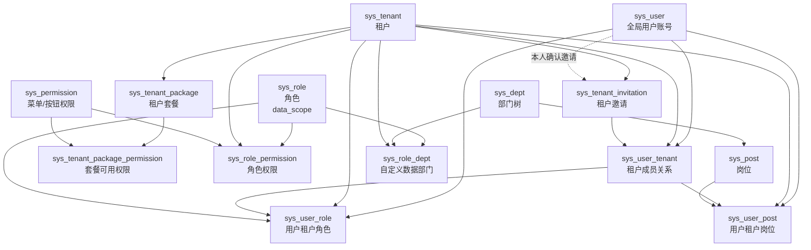
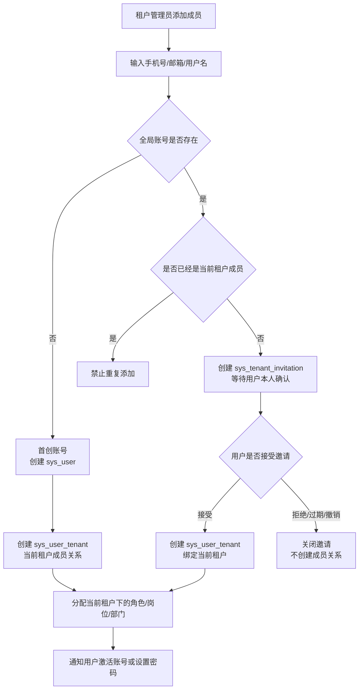
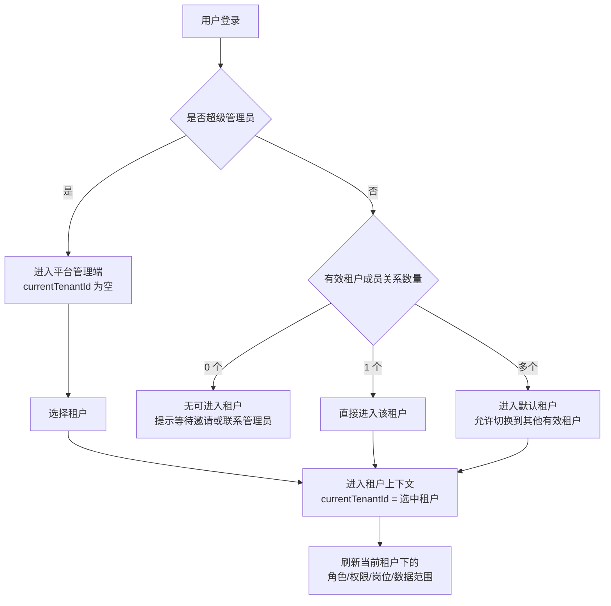

# Whim 多租户与权限架构

## 整体关系



## 用户与租户身份原则

`sys_user` 是全局账号，只表达登录身份，不直接代表某个租户身份。手机号、邮箱、用户名等登录标识应当在全局范围内保持唯一，避免同一个自然人被重复创建成多个账号。

`sys_user_tenant` 是用户在某个租户下的成员关系，表达“这个全局账号是否属于该租户”。角色、岗位、部门、数据范围等业务身份必须基于当前租户成员关系计算，不能只基于 `sys_user` 计算。

一个用户可以属于多个租户，但任何租户都不能单方面把已经存在的全局账号直接拉入自己的租户。已有账号加入新租户必须通过邀请确认流程完成。

## 首创账号与邀请加入

租户管理员添加成员时，系统先按全局唯一登录标识查询 `sys_user`，再决定走首创账号还是邀请加入。



### 首创账号

首创账号只适用于全局账号不存在的场景。当前租户可以创建 `sys_user` 和第一条 `sys_user_tenant` 成员关系，并为该用户配置当前租户下的角色、岗位、部门等信息。

首创账号不代表租户拥有这个账号。账号创建后仍然是全局身份，后续其他租户如果也要添加该用户，必须走邀请确认流程，不能再次创建重复账号。

首创账号建议配合账号激活机制。租户可以先建立成员身份，但用户首次登录时应当完成手机号/邮箱验证、密码设置或其他身份确认动作。

### 邀请加入

邀请加入适用于全局账号已经存在，但该账号还不是当前租户成员的场景。租户只能创建 `sys_tenant_invitation`，不能直接创建 `sys_user_tenant`。

邀请必须由用户本人确认。用户接受邀请后，系统再次校验邀请状态、租户状态、账号身份和是否已经加入当前租户，校验通过后才创建 `sys_user_tenant` 成员关系。

邀请可以提前携带当前租户内的默认角色、岗位、部门等分配信息，但这些信息只有在邀请被接受并创建成员关系后才真正生效。

## 表关系作用说明

### 全局身份与租户边界

`sys_user` 是全局用户账号表，用来承载登录身份。手机号、邮箱、用户名、密码、账号状态、最近登录时间等信息放在这里。它解决的是“这个人是谁、能不能登录”的问题，不解决“这个人在某个租户里是什么身份”的问题，所以不能在这张表上直接放角色、部门、岗位、数据范围等租户内信息。

`sys_tenant` 是租户主体表，用来承载公司、组织、工作空间等租户边界。系统内所有租户私有数据最终都要落到某个 `tenant_id` 下，接口查询、数据写入、权限判断都应当先确认当前 `currentTenantId`。

`sys_permission` 是全局权限字典表，用来统一定义系统支持的菜单、按钮、接口权限编码。它是平台级能力清单，不属于某一个租户。租户能不能使用某个权限，需要再经过租户套餐和租户角色共同判断。

### 成员关系与邀请关系

`sys_user_tenant` 是租户成员关系表，用来表达“某个全局账号已经加入某个租户”。它是用户进入租户上下文的核心依据，建议包含 `user_id`、`tenant_id`、成员状态、是否默认租户、加入时间、来源类型等字段。`user_id + tenant_id` 应当保持唯一。

`sys_tenant_invitation` 是租户邀请表，用来承载“租户想邀请某个账号加入，但还没有得到用户本人确认”的中间状态。它解决的是已有账号不能被租户直接拉入的问题，建议包含 `tenant_id`、邀请手机号、邀请邮箱、邀请人、被邀请账号、默认角色、默认岗位、邀请状态、过期时间、接受时间等字段。邀请被用户本人接受后，系统才允许创建 `sys_user_tenant`。

### 套餐与功能上限

`sys_tenant_package` 是租户套餐表，用来定义租户购买或启用的产品版本，例如基础版、专业版、企业版。它解决的是“这个租户整体最多可以使用哪些能力”的问题，不直接表达某个用户最终能不能操作某个按钮。

`sys_tenant_package_permission` 是套餐权限关系表，用来定义某个套餐包含哪些 `sys_permission`。它是租户功能权限的上限来源。即使某个角色授予了某个权限，只要当前租户套餐不包含该权限，用户最终也不能使用。

### 租户内角色与权限

`sys_role` 是租户角色表，用来定义当前租户内的角色，例如租户管理员、部门主管、普通员工。角色应当归属于某个 `tenant_id`，并通过 `data_scope` 定义数据范围类型。

`sys_user_role` 是用户角色关系表，用来定义某个用户在当前租户下拥有哪些角色。它必须和 `sys_user_tenant` 配合使用，只有用户已经是当前租户的有效成员时，才能给用户分配当前租户下的角色。

`sys_role_permission` 是角色权限关系表，用来定义某个角色拥有哪些菜单、按钮或接口权限。用户最终功能权限来自当前租户套餐权限和当前租户角色权限的交集。

### 租户内组织与数据范围

`sys_dept` 是租户部门表，用来维护当前租户内的部门树。它是组织结构和数据权限计算的重要基础，部门数据必须归属于某个 `tenant_id`。

`sys_post` 是租户岗位表，用来表达当前租户内的岗位或职位。岗位应当归属于租户，并关联到部门，用来承载用户在组织中的位置。

`sys_user_post` 是用户岗位关系表，用来定义某个用户在当前租户下拥有哪些岗位。岗位关系不能跨租户复用，同一个用户在不同租户下可以拥有完全不同的岗位。

`sys_role_dept` 是角色自定义部门数据权限表，用来在角色的数据范围为自定义部门时，保存该角色可以访问哪些部门的数据。它只在当前租户内生效，不能突破 `currentTenantId` 的租户边界。

### 全局运行主线

用户登录时，系统先通过 `sys_user` 确认全局账号身份。登录成功后，系统通过 `sys_user_tenant` 查询该账号可以进入哪些租户，并设置当前租户上下文 `currentTenantId`。

租户管理员添加成员时，系统先查询 `sys_user`。如果账号不存在，当前租户可以首创账号并创建第一条 `sys_user_tenant`；如果账号已经存在，当前租户只能创建 `sys_tenant_invitation`，等待用户本人确认后再创建 `sys_user_tenant`。

用户进入租户后，系统基于 `currentTenantId + user_id` 查询 `sys_user_role` 和 `sys_user_post`，得到当前租户下的角色、岗位和组织身份。

功能权限计算时，系统先通过 `sys_tenant_package` 和 `sys_tenant_package_permission` 得到租户套餐允许的权限上限，再通过 `sys_user_role`、`sys_role`、`sys_role_permission` 得到用户角色授予的权限，最终取两者交集。

数据权限计算时，系统始终先使用 `currentTenantId` 限制租户边界，再根据 `sys_role.data_scope` 和 `sys_role_dept` 计算部门、本部门及以下、本人或自定义部门等数据范围。

## 登录与租户切换



`currentTenantId` 表示当前正在操作的租户。普通用户只能切换自己已经激活的租户成员关系，超级管理员可以进入平台管理端，也可以切换到任意租户。

租户切换后，角色、权限、岗位、部门和数据范围都必须重新加载。不能沿用上一个租户上下文中的授权结果。

## 关键约束

全局账号唯一：同一个手机号、邮箱或其他登录标识不能重复创建 `sys_user`。

租户成员唯一：同一个 `user_id + tenant_id` 只能存在一条有效成员关系。

不能直接拉人：当全局账号已经存在时，租户只能发起邀请，不能绕过用户确认直接创建成员关系。

邀请本人确认：接受邀请时，登录用户必须与邀请目标账号一致。

授权依赖成员关系：角色、岗位、部门、数据权限必须依赖当前租户下的有效成员关系。

## 权限计算

```text
功能权限 = 租户套餐允许的权限 ∩ 当前租户角色授予的权限
数据权限 = 当前租户边界 + 当前租户角色的数据范围
组织归属 = 当前租户 + 用户岗位 + 岗位所属部门
```
